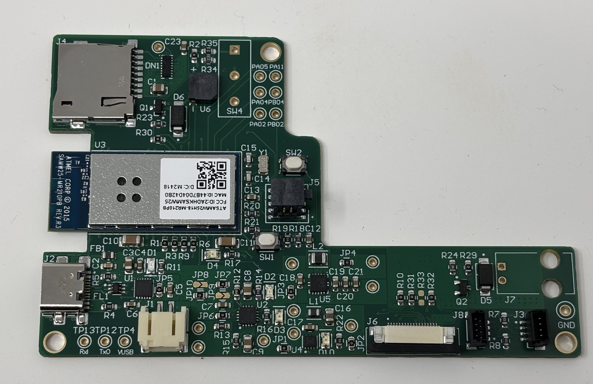
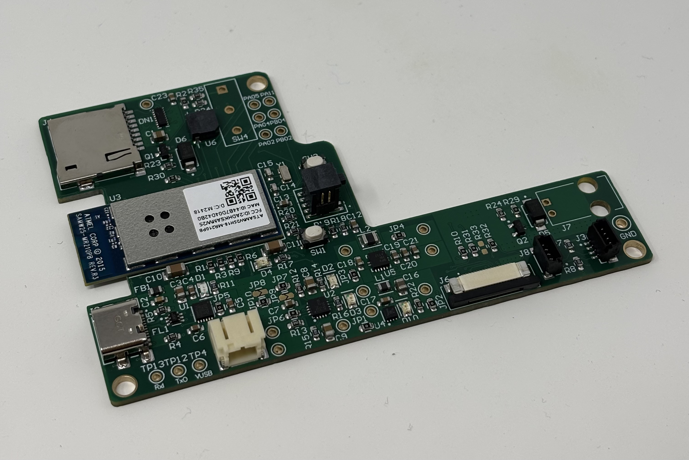
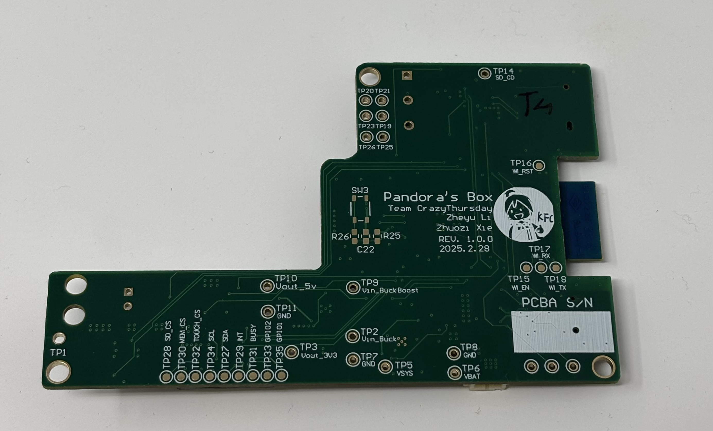
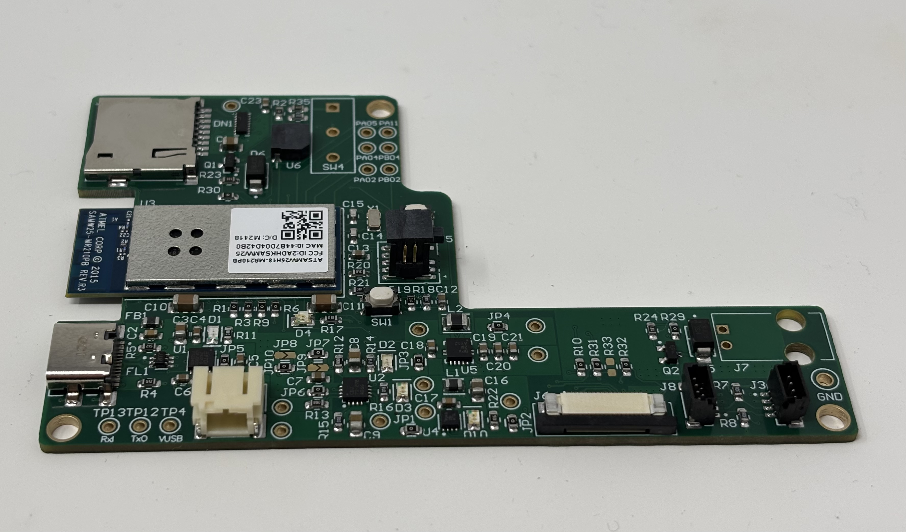

# IoT-Phone-Locker-full-stackimplementation
Full stack implementation of a portable phone locker, including Hardware design and firmaware based on ASF4 &amp; FreeRTOS

* GithubPage Repository URL: https://github.com/ZheyuLi-SEAS/crazythursday.github.io/tree/main
* GithubPage URL: https://zheyuli-seas.github.io/crazythursday.github.io/

# Quick view of PCBA

